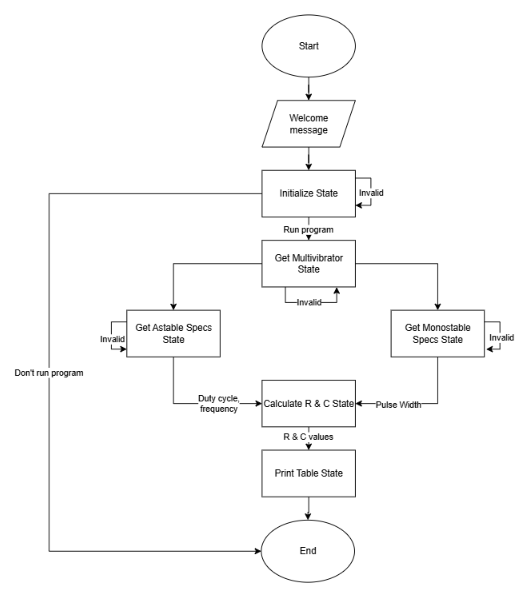
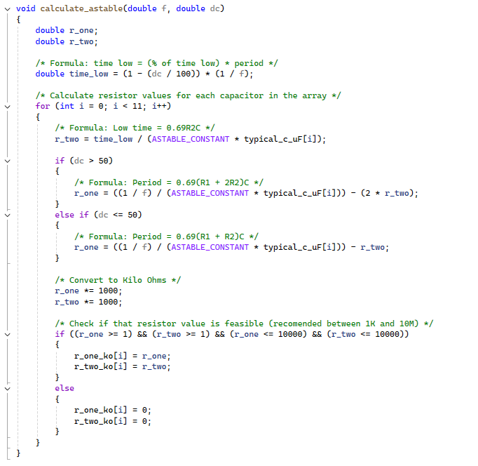
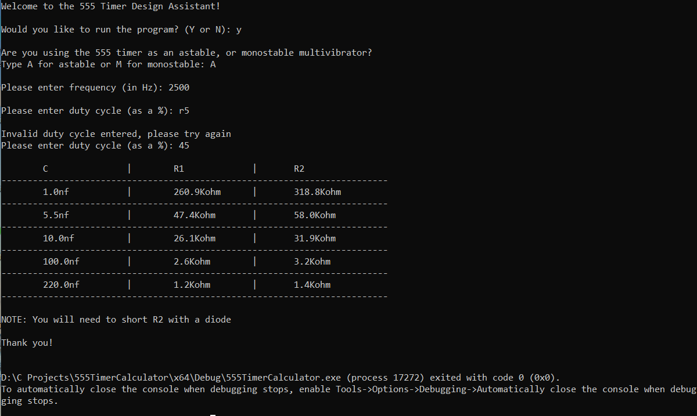

# 555 Timer Design Assistant (in C)

This is a final project for the *Programming for Electronics (663-104)* course. It is a command-line tool written in C that helps electronics students and engineers determine valid resistor and capacitor combinations for 555 timer circuits.

The tool supports both **monostable** and **astable** configurations, and allows users to input timing criteria such as frequency, duty cycle, or pulse width. Based on those values, it outputs a table of valid component combinations.

---

## Features

- State machine program flow
- Supports **astable** (continuous pulse) and **monostable** (single pulse) modes
- Calculates resistor values based on common capacitor sizes
- Validates user input for safe and clean execution
- Outputs tables with component combinations
- Includes unit conversion for intuitive readability (kΩ, MΩ, nF, µF)

---

## Screenshots

### Program Flow (State Diagram)


### Sample Code (Calculation Function)


### Sample Output


> (Replace these with the actual image file names in your repo)

---

## How to Compile and Run

This project was written in C and can be compiled using `gcc`.

### Compilation:
```bash
gcc 555TimerDesignAssistant.c -o 555TimerDesignAssistant

---

## Files Included
- 555TimerDesignAssistant.c - The main source code
- 555 Timer Design Assistant Write-Up - Project report detailing design, approach, and reflection
- Images – State machine diagram and code snippet visuals

---

## Author
**Rudolph Hofmeister**
Programming for Electronics – Final Project
July 2025
